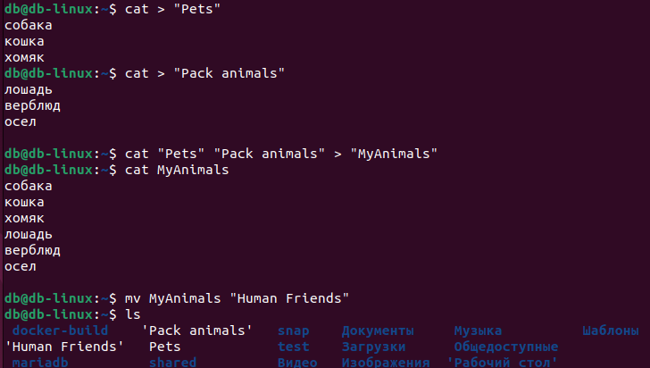
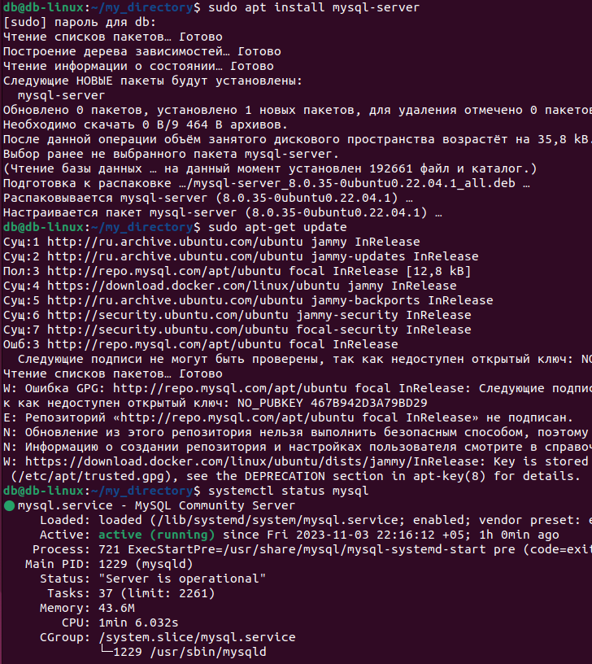
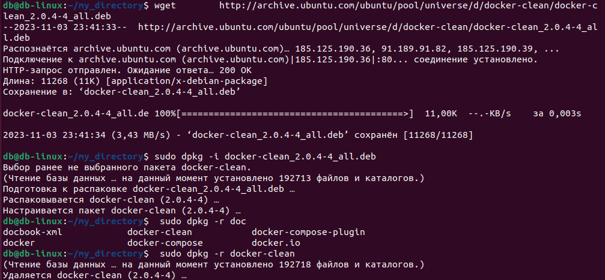
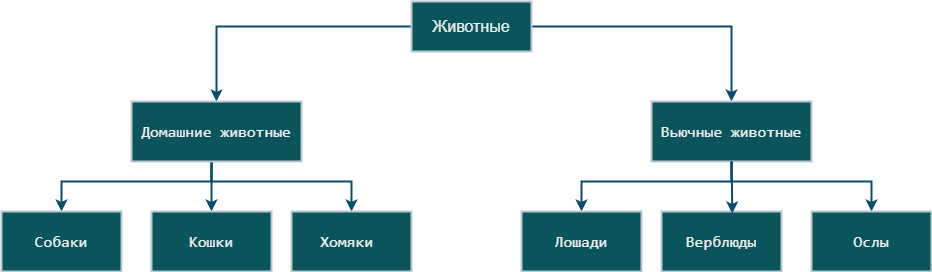

# Final-control-work-specialization-block

Итоговая контрольная работа по блоку специализации

## Операционные системы и виртуализация (Linux)

1.  Использование команды cat в Linux

- Создать два текстовых файла: "Pets"(Домашние животные) и "Pack animals"(вьючные животные), используя команду `cat` в терминале Linux. В первом файле перечислить собак, кошек и хомяков. Во втором — лошадей, верблюдов и ослов.
- Объединить содержимое этих двух файлов в один и просмотреть его содержимое.
- Переименовать получившийся файл в "Human Friends".

Пример конечного вывода после команды “ls” :
Desktop Documents Downloads HumanFriends.txt Music PackAnimals.txt Pets.txt Pictures Videos



2. Работа с директориями в Linux

- Создать новую директорию и переместить туда файл "Human Friends".


3. Работа с MySQL в Linux. “Установить MySQL на вашу вычислительную машину ”

- Подключить дополнительный репозиторий MySQL и установить один из пакетов из этого репозитория.



4. Управление deb-пакетами

- Установить и затем удалить deb-пакет, используя команду `dpkg`.



5. История команд в терминале Ubuntu

- Сохранить и выложить историю ваших терминальных команд в Ubuntu.
  В формате: Файла с ФИО, датой сдачи, номером группы(или потока)

[Фаил с истории терминальных команд в Ubuntu](</docs/Зубрилин_АО_04_11(history).pdf>)

6. Диаграмма классов
   - Создать диаграмму классов с родительским классом "Животные", и двумя подклассами: "Pets" и "Pack animals".
     В составы классов которых в случае Pets войдут классы: собаки, кошки, хомяки, а в класс Pack animals войдут: Лошади, верблюды и ослы).



## Работа с MySQL

В подключенном MySQL репозитории создать базу данных “Друзья
человека”

```sql
CREATE DATABASE Human_Friends;
```

Создать таблицы с иерархией из диаграммы в БД

```sql
USE Human_friends;

CREATE TABLE Pets (
    id INT PRIMARY KEY,
    name VARCHAR(50),
    type VARCHAR(20),
    birth_date DATE,
    commands VARCHAR(200)
);

CREATE TABLE PackAnimals (
    id INT PRIMARY KEY,
    name VARCHAR(50),
    type VARCHAR(20),
    birth_date DATE,
    commands VARCHAR(200)
);

CREATE TABLE Dogs (
    id INT PRIMARY KEY,
    name VARCHAR(50),
    birth_date DATE,
    commands VARCHAR(200)
);

CREATE TABLE Cats (
    id INT PRIMARY KEY,
    name VARCHAR(50),
    birth_date DATE,
    commands VARCHAR(200)
);

CREATE TABLE Hamsters (
    id INT PRIMARY KEY,
    name VARCHAR(50),
    birth_date DATE,
    commands VARCHAR(200)
);

CREATE TABLE Horses (
    id INT PRIMARY KEY,
    name VARCHAR(50),
    birth_date DATE,
    commands VARCHAR(200)
);

CREATE TABLE Camels (
    id INT PRIMARY KEY,
    name VARCHAR(50),
    birth_date DATE,
    commands VARCHAR(200)
);

CREATE TABLE Donkeys (
    id INT PRIMARY KEY,
    name VARCHAR(50),
    birth_date DATE,
    commands VARCHAR(200)
);

```

Заполнить низкоуровневые таблицы именами(животных), командами
которые они выполняют и датами рождения

```sql
INSERT INTO Pets (id, name, birth_date, commands)
VALUES (1, 'Fido', '2020-01-01', 'Sit, Stay, Fetch');

INSERT INTO Pets (id, name, birth_date, commands)
VALUES (2, 'Whiskers', '2019-05-15', 'Sit, Pounce');

INSERT INTO Pets (id, name, birth_date, commands)
VALUES (3, 'Hammy', '2021-03-10', 'Roll, Hide');

INSERT INTO PackAnimals (id, name, birth_date, commands)
VALUES (1, 'Thunder', '2015-07-21', 'Trot, Canter, Gallop');

INSERT INTO PackAnimals (id, name, birth_date, commands)
VALUES (2, 'Sandy', '2016-11-03', 'Walk, Carry Load');

INSERT INTO PackAnimals (id, name, birth_date, commands)
VALUES (3, 'Eeyore', '2017-09-18', 'Walk, Carry Load, Bray');
```

Удалите записи о верблюдах

```sql
DELETE FROM PackAnimals WHERE type = 'Camel';
```

Объедините таблицы лошадей и ослов

```sql
CREATE TABLE HorsesDonkeys AS
SELECT * FROM Horses
UNION
SELECT * FROM Donkeys;
```

Создайте новую таблицу для животных в возрасте от 1 до 3 лет

```sql
CREATE TABLE YoungAnimals AS
SELECT *, DATEDIFF(CURDATE(), birth_date)/365 AS age FROM Pets WHERE DATEDIFF(CURDATE(), birth_date)/365 BETWEEN 1 AND 3;
```

Объедините все таблицы в одну

```sql
CREATE TABLE AllAnimals AS
SELECT *,'Pets' AS source FROM Pets
UNION
SELECT *,'PackAnimals' FROM PackAnimals
UNION
SELECT *,'HorsesDonkeys' FROM HorsesDonkeys
UNION
SELECT *,'YoungAnimals' FROM YoungAnimals;
```
